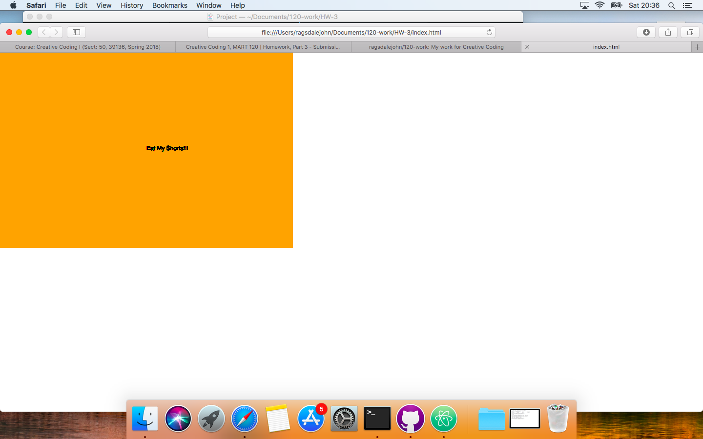

John Ragsdale, 50

[ "Hello World!"" ](https://ragsdalejohn.github.io/120-work/course-work/HW-3/)

# HW-# Response

This week I followed the instructions given to the letter. I made only creative choices such as text used for hello world and color change for the background.

The only isses I experienced towards this assignment was things lie spaces after closing quotes or forgetting "function" before an action like draw.

### HW-3 Conclusion

I was late with this assignment and could help no one, and no further discussion needed on this section.

#### Final Sketch

Here you go!

